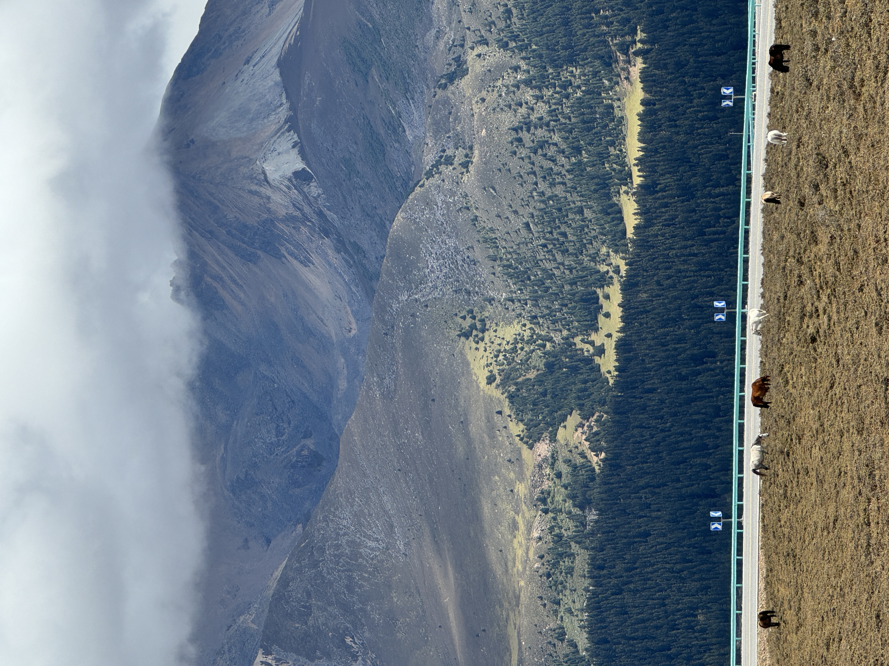

<!-- ================= 页面结构 ================= -->

<button class="nav-arrow left-arrow" onclick="scrollGallery(-1)">&#10094;</button>

  
  
Kangding, Sichuan')">
    
  

  
  
Aba Prefecture, Sichuan')">
    
  

  
  
Ya\'an, Sichuan')">
    
  

  
  
Arxan, Inner Mongolia')">
    
  

  
  
Dunhuang, Gansu')">
    
  

  
  
Arxan, Inner Mongolia')">
    
  

  
  
Arxan, Inner Mongolia')">
    
  

  
  
Litang, Sichuan')">
    
  

  
  
Anshan, Liaoning')">
    
  

  

Ya\'an, Sichuan')">
    
  

  
  
Garze Prefecture, Sichuan')">
    
  

<button class="nav-arrow right-arrow" onclick="scrollGallery(1)">&#10095;</button>

<!-- Spotlight 模态框 -->

  
(00)

  
DESC TEXT

