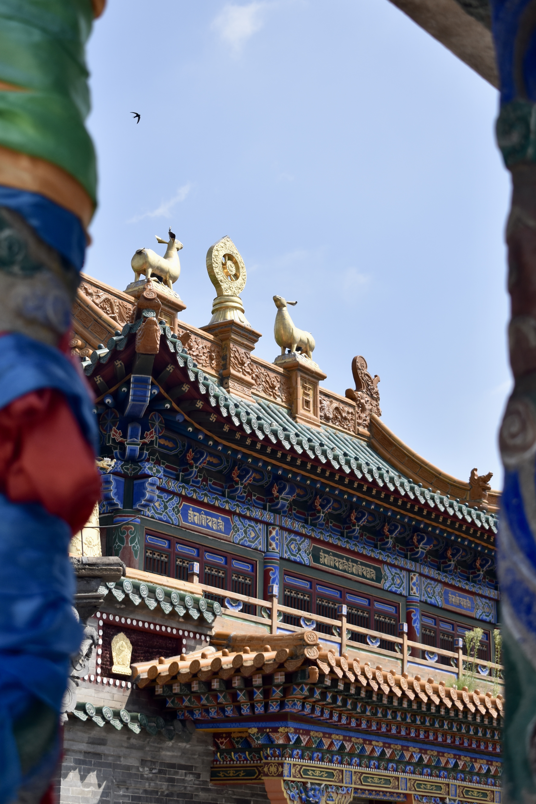
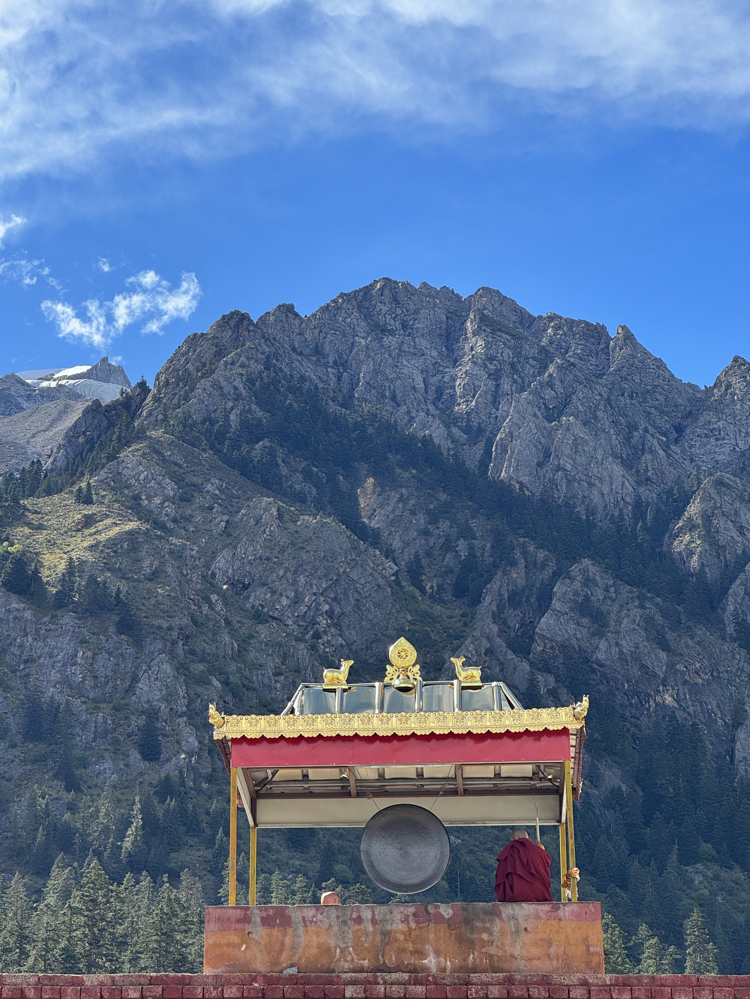
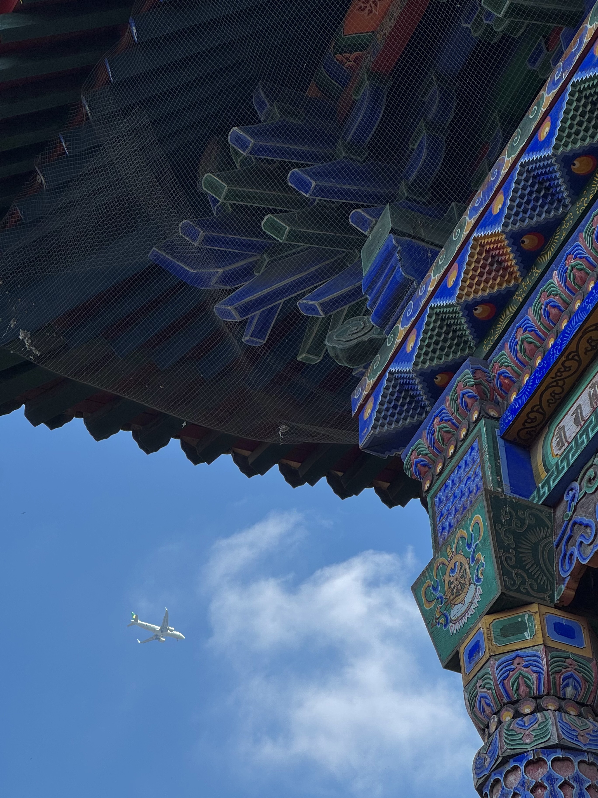
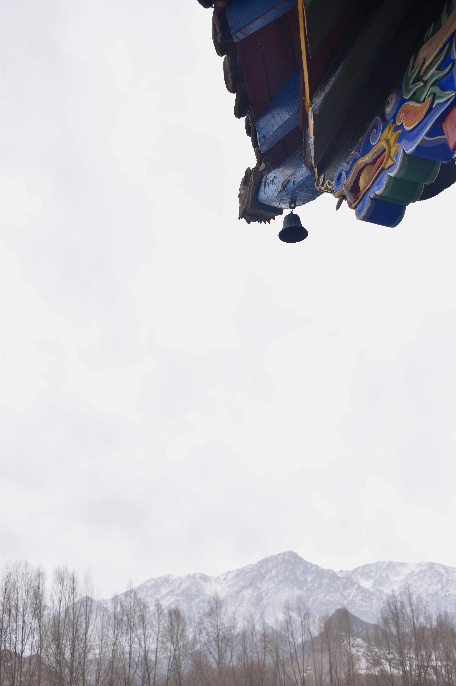
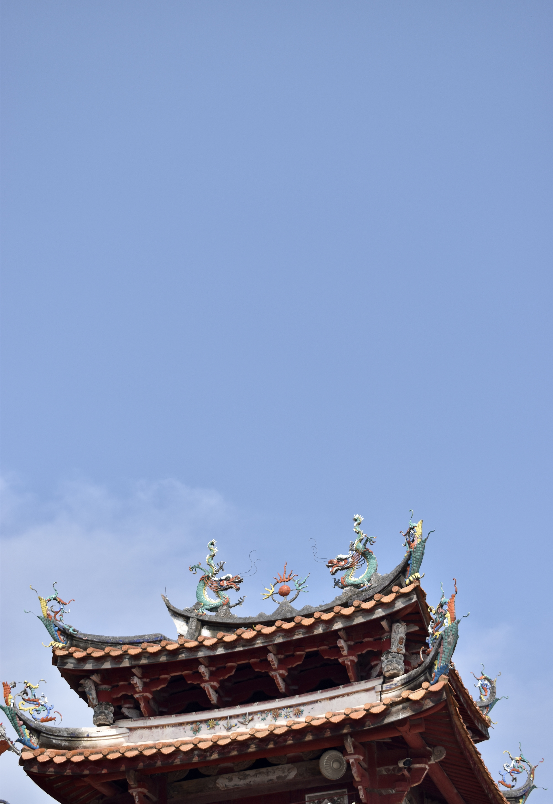
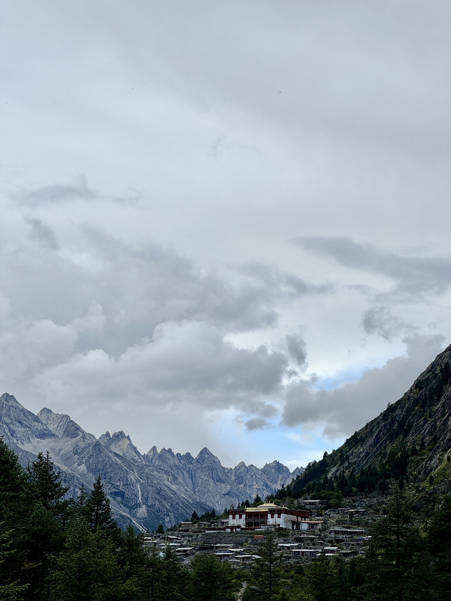
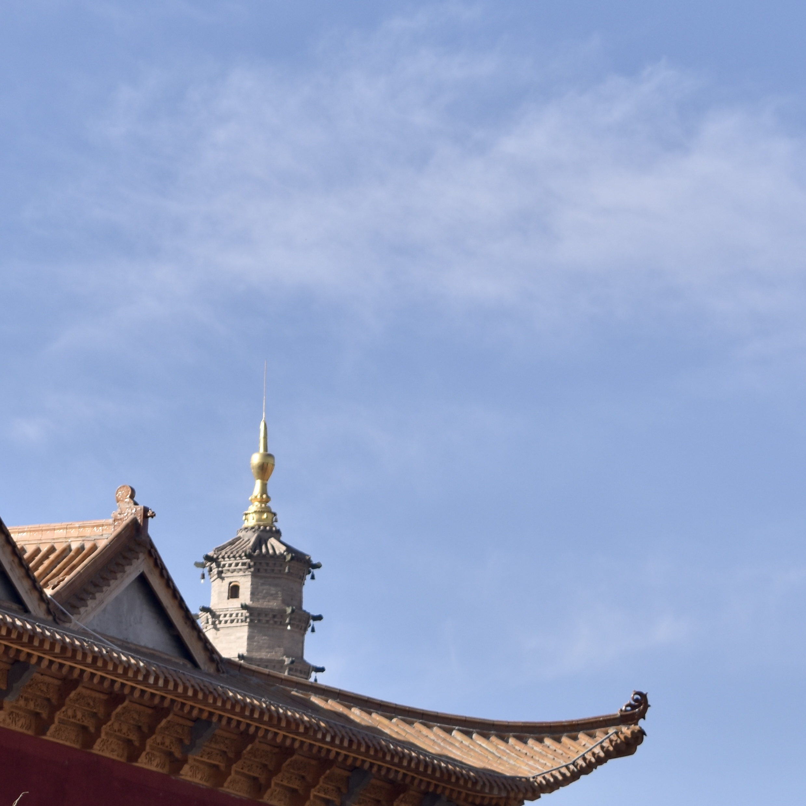
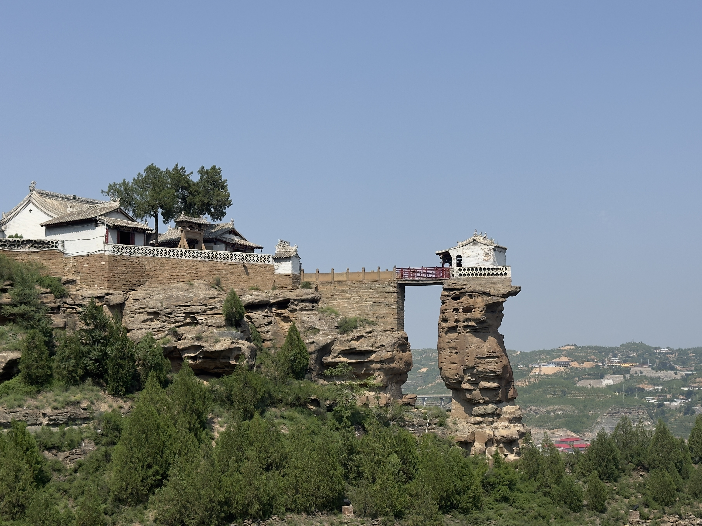
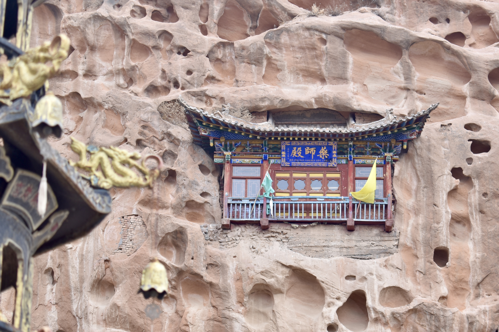
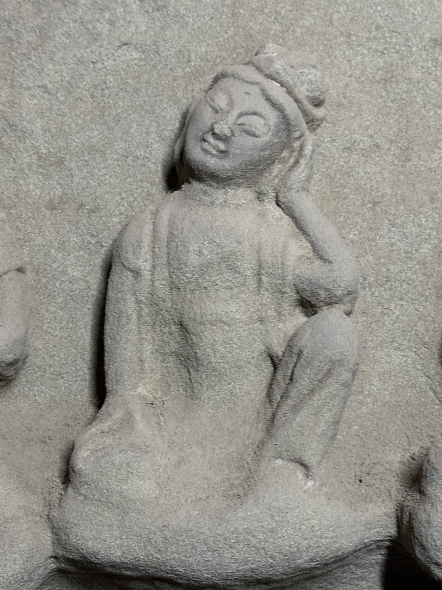

<!-- ================= 页面结构 ================= -->

<!-- 左箭头 -->
<button class="nav-arrow left-arrow" onclick="scrollGallery(-1)">&#10094;</button>

  <!-- 注意：这里我帮你提取了所有21张图片的名字，极其小心地保留了大小写！ -->
  <!-- 参数分别是：(1)图片路径, (2)编号, (3)详细描述 -->
  
  
xili tuzhao, 2025')">
    
  

Lenggu Temple (New), 2024')">
  

xili tuzhao, 2025')">

  
Mati Temple, 2023')">
    
  

zhongshan grottoes')">

  
Tianhou Palace, 2023')">
    
  

Jinta Temple Grottoes')">

Lenggu Temple (Old), 2024')">

Kumarajiva stupa')">

  
xianglu temple, 2025')">

  
Lenggu Temple (Old), 2024')">

  
Tianhou Palace, 2023')">

  
Tian Ti Mountain Grottoes')">

  
Tian Ti Mountain Grottoes')">

  
zhongshan grottoes')">

  
Yunfeng Temple')">

<!-- 右箭头 -->
<button class="nav-arrow right-arrow" onclick="scrollGallery(1)">&#10095;</button>

<!-- 沉浸式放大层：平时隐藏，点击后触发 -->

<!-- 阻止点击内部图片时关闭模态框 -->

<!-- 截图2里的文字信息区域 -->

  
(00)

  
DESC TEXT

<!-- 被放大的图片 -->

<!-- ================= 核心交互脚本 ================= -->

